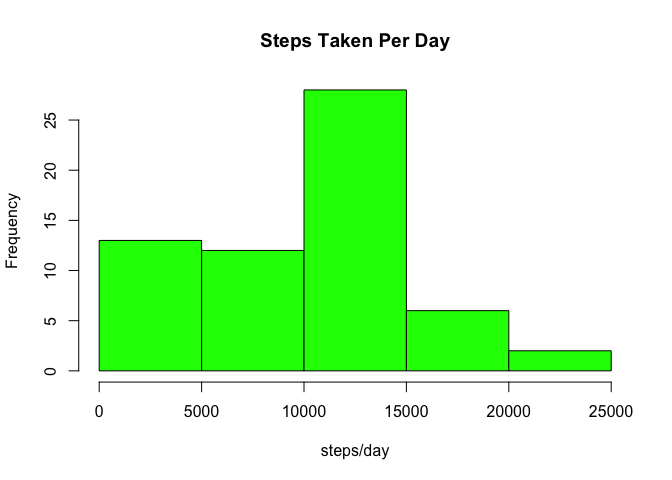
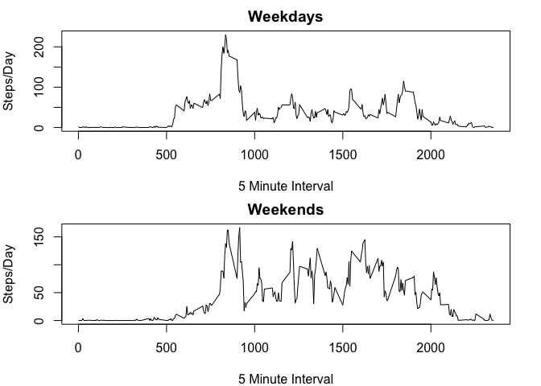

# Reproducible Research: Peer Assessment 1


## Loading and preprocessing the data

```r
library(lubridate)
file <- "activity.csv"
data <- read.csv(file, header = TRUE, stringsAsFactor = FALSE)
data$date <- ymd(data$date)
```

## What is mean total number of steps taken per day?

```r
library(dplyr)
```

```
## 
## Attaching package: 'dplyr'
## 
## The following objects are masked from 'package:lubridate':
## 
##     intersect, setdiff, union
## 
## The following object is masked from 'package:stats':
## 
##     filter
## 
## The following objects are masked from 'package:base':
## 
##     intersect, setdiff, setequal, union
```

```r
by_date <- 
    data %>%
    select(date, steps) %>%
    group_by(date) %>%
    summarize(stepsDay = sum(steps, na.rm = TRUE))
Avg_steps <- round(mean(by_date$stepsDay))
Median_steps <- median(by_date$stepsDay)
```


```r
hist(by_date$stepsDay, main = "Steps Taken Per Day", col = "green", xlab = "steps/day")
```

 

Above is a histogram of the total number of steps taken per day. Missing values were removed calling the argument na.rm = TRUE on sum().  

The mean total number of steps taken by the subject is **9354**.  

The median total number of steps take by the subject is **10395**.  

## What is the average daily activity pattern?

```r
by_interval <- 
    data %>%
    select(interval, steps) %>%
    group_by(interval) %>%
    summarize(avgStepsInt = mean(steps, na.rm = TRUE))
maxActiveInt <- as.numeric(by_interval[by_interval$avgStepsInt == max(by_interval$avgStepsInt),1])
maxSteps <-  round(max(by_interval$avgStepsInt))
```

```r
plot(by_interval$interval, by_interval$avgStepsInt, type = "l", xlab = "5-minute interval", ylab = "steps")
```

 

The 5 minute interval with the maximun number of steps is interval **835** with an average of **206** of steps taken.  

## Imputing missing values


```r
countNA <- length(which(is.na(data$steps)))
data_ver <- data[which(is.na(data$steps)),]
verif <- 
    data_ver %>%
    group_by(date) %>% 
    summarize(count = n(),
              sum_int = sum(interval))
```
There is a total of **2304** rows with missing values.  

After careful evaluation of the data, it was clear that there were full days in which values for the steps variable were not available. To verify this, a data set was created by subsetting the original dataset with the rows with missing values counting the number of rows and the sum of the interval. See the table below:  

```
##         date count sum_int
## 1 2012-10-01   288  339120
## 2 2012-10-08   288  339120
## 3 2012-11-01   288  339120
## 4 2012-11-04   288  339120
## 5 2012-11-09   288  339120
## 6 2012-11-10   288  339120
## 7 2012-11-14   288  339120
## 8 2012-11-30   288  339120
```
The number of rows with missing values in each day is 288 which corresponds to the number of interval recorded per day. This evaluation was performed to ensure there were no days with both recorded and missing values.  

This information was used to devise a strategy for inputing missing values. The strategy consist of inputing the missing values with the mean steps per interval calculated in the previous step. A new dataset was created by subsetting the original dataset by each date corresponding to missing values and inputting the the mean values per interval. 


```r
data2 <- read.csv(file, header = TRUE, stringsAsFactor = FALSE)
data2[which(data2$date == "2012-10-01"),1] <- by_interval$avgStepsInt
data2[which(data2$date == "2012-10-08"),1] <- by_interval$avgStepsInt
data2[which(data2$date == "2012-11-01"),1] <- by_interval$avgStepsInt
data2[which(data2$date == "2012-11-04"),1] <- by_interval$avgStepsInt
data2[which(data2$date == "2012-11-09"),1] <- by_interval$avgStepsInt
data2[which(data2$date == "2012-11-10"),1] <- by_interval$avgStepsInt
data2[which(data2$date == "2012-11-14"),1] <- by_interval$avgStepsInt
data2[which(data2$date == "2012-11-30"),1] <- by_interval$avgStepsInt
data2$date <- ymd(data2$date)
by_date2 <- 
    data2 %>%
    select(date, steps) %>%
    group_by(date) %>%
    summarize(stepsDay2 = sum(steps))
Avg_steps2 <- round(mean(by_date2$stepsDay2))
Median_steps2 <- median(by_date2$stepsDay2)
hist(by_date2$stepsDay2, main = "Steps Taken Per Day", col = "red", xlab = "steps/day")
```

 

As can be seen, the data has been normalized by imputting missing values with the mean steps taken per 5 minute interval. The new **mean** and **median** are equal with a value of **10766.19**.  

The data was being affected by removing the missing values. When summarizing the data using dplyr package, the sum of the steps taken was equal to zero for days with missing values for the steps variable. There were 8 days total with missing values which affected the original mean and median calculations. It is unlikely that the subject took no steps in those days given the activity shown in the other days. 

## Are there differences in activity patterns between weekdays and weekends?


```r
weekdaysV <- c("Monday", "Tuesday", "Wednesday", "Thursday", "Friday")
data2$wkday <- factor((weekdays(data2$date) %in% weekdaysV), levels=c(FALSE, TRUE), labels=c('weekend', 'weekday'))

weekdays <- data2[which(data2$wkday == "weekday"),]
weekends <- data2[which(data2$wkday == "weekend"),]

by_wkday <- 
    weekdays %>%
    select(interval, steps) %>%
    group_by(interval) %>%
    summarize(avgSteps = mean(steps))

by_wkend <- 
    weekends %>%
    select(interval, steps) %>%
    group_by(interval) %>%
    summarize(AvgSteps = mean(steps))

DF_wkend <- as.data.frame(by_wkend)
DF_wkday <- as.data.frame(by_wkday)

par(mfrow = c(2,1), mar = c(4,4,2,2))
plot(DF_wkday[,1], DF_wkday[,2], type = "l", xlab = "5 Minute Interval", ylab = "Steps/Day", main = "Weekdays")
plot(DF_wkend[,1], DF_wkend[,2], type = "l", xlab = "5 Minute Interval", ylab = "Steps/Day", main = "Weekends")
```

 

```r
dev.off()
```

```
## null device 
##           1
```


