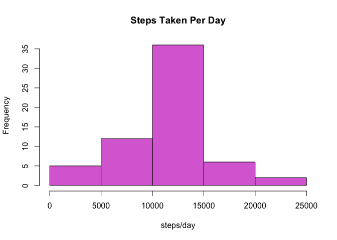
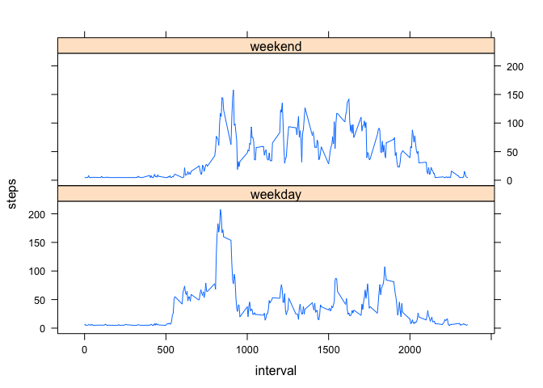

# Reproducible Research: Peer Assessment 1


## Loading and preprocessing the data

```r
library(lubridate)
file <- "activity.csv"
data <- read.csv(file, header = TRUE, stringsAsFactor = FALSE)
data$date <- ymd(data$date)
```

## What is mean total number of steps taken per day?

```r
steps_day <- with(data, aggregate(steps, by = list(date), FUN=sum))    
hist(steps_day[,2], main = "Steps Taken Per Day", col = "turquoise", xlab = "steps/day")
```

 

```r
mean(steps_day[,2], na.rm = TRUE)  
```

```
## [1] 10766.19
```

```r
median(steps_day[,2], na.rm = TRUE) 
```

```
## [1] 10765
```

## What is the average daily activity pattern?

```r
steps_int <- with(data, aggregate(steps, by = list(interval), FUN=mean, na.rm=TRUE))
maxActiveInt <- as.numeric(steps_int[which.max(steps_int[,2]),1])
maxSteps <-  round(max(steps_int[,2]))
```

```r
plot(steps_int[,1], steps_int[,2], type = "l", xlab = "5-minute interval", ylab = "steps")
```

 

The 5 minute interval with the maximun number of steps is interval **835** with an average of **206** of steps taken.  

## Imputing missing values


```r
countNA <- sum(!complete.cases(data))
```
There is a total of **2304** rows with missing values.  

Further evaluation of the data shows there are full days with missing values for the steps variable. To verify this, a data set was created by subsetting the original dataset with rows containing missing values and sumarizing the data by counting the number of rows per date.

```r
library(dplyr)
data_ver <- data[which(is.na(data$steps)),]
verif <- data_ver %>% group_by(date) %>% summarize(count = n())
print(as.data.frame(verif))
```

```
##         date count
## 1 2012-10-01   288
## 2 2012-10-08   288
## 3 2012-11-01   288
## 4 2012-11-04   288
## 5 2012-11-09   288
## 6 2012-11-10   288
## 7 2012-11-14   288
## 8 2012-11-30   288
```
There are 8 days each containing a total of 288 rows of missing values. This number corresponds to the number of intervals recorded each day. This evaluation was performed to ensure there were no days with both recorded and missing values.    

This information was used to devise a strategy for imputing missing values. The strategy consists of imputing missing values with the mean steps taken per interval calculated in the previous step. 


```r
data2 <- read.csv(file, header = TRUE, stringsAsFactor = FALSE)
data2[which(data2$date == "2012-10-01"),1] <- steps_int[,2]
data2[which(data2$date == "2012-10-08"),1] <- steps_int[,2]
data2[which(data2$date == "2012-11-01"),1] <- steps_int[,2]
data2[which(data2$date == "2012-11-04"),1] <- steps_int[,2]
data2[which(data2$date == "2012-11-09"),1] <- steps_int[,2]
data2[which(data2$date == "2012-11-10"),1] <- steps_int[,2]
data2[which(data2$date == "2012-11-14"),1] <- steps_int[,2]
data2[which(data2$date == "2012-11-30"),1] <- steps_int[,2]
data2$date <- ymd(data2$date)
new_data <- with(data2, aggregate(steps, by=list(date), FUN=sum))
hist(new_data[,2], main = "Steps Taken Per Day", col = "orchid", xlab = "steps/day")
```

 

## New mean and median calculations.  


```r
mean(new_data[,2])
```

```
## [1] 10766.19
```

```r
median(new_data[,2])
```

```
## [1] 10766.19
```

The data was normalized by imputting missing values with the mean steps taken per 5 minute interval. The new **mean** and **median** are equal with a value of **10766.19**. The data was not affected drastically by imputing the missing values with the mean interval values. The median shifted to the mean and the total number of steps taken daily slightly increased as can be seen from the histogram.  

## Are there differences in activity patterns between weekdays and weekends?


```r
weekend <- c("Saturday", "Sunday")
data2$wkday <- factor((weekdays(data2$date) %in% weekend), levels=c(FALSE, TRUE), labels=c('weekday', 'weekend'))
wkdata <- aggregate(steps~interval+wkday, data2, FUN=mean)
library(lattice)
xyplot(steps~interval|wkday, wkdata, layout=c(1,2), type = "l")
```

 

```r
dev.off()
```

```
## null device 
##           1
```


